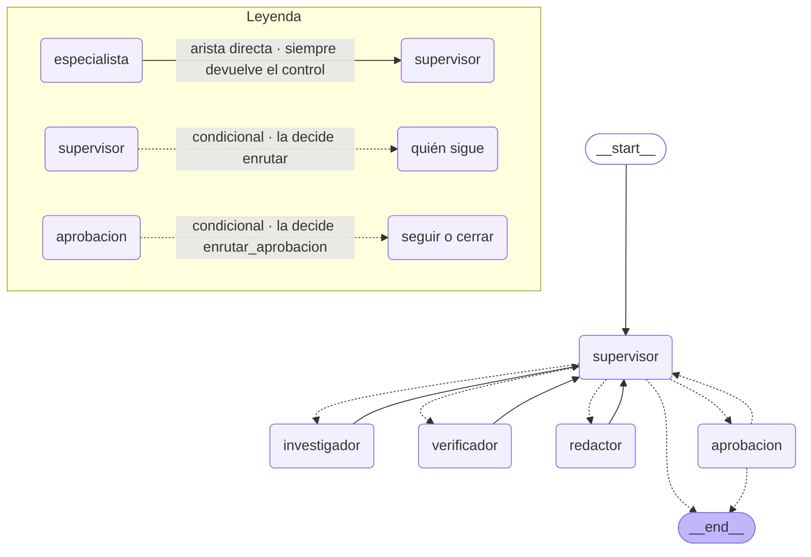
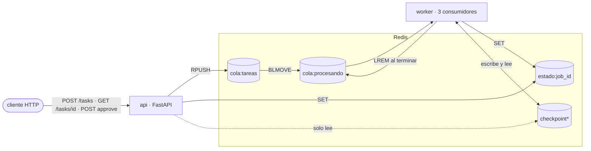

# Orquestador jurídico multi-agente

Un sistema multi-agente que responde consultas sobre la doctrina del recurso extraordinario
federal citando fallos reales de la Corte Suprema argentina, expuesto como una API REST.

La arquitectura tiene tres piezas. Una **API** que acepta consultas y contesta en el acto. Un
**worker** que corre el trabajo en otro proceso, con un grafo de cinco nodos donde un supervisor
delega en tres especialistas. Y **Redis**, que guarda la cola, el estado de cada trabajo y los
checkpoints del grafo: es lo que permite que un trabajo cruce de un proceso al otro y sobreviva
a un reinicio.

Antes de publicar, el sistema mide su propio resultado: cuántas de sus citas resistieron la
verificación, en cuántas se apoya la respuesta y cuántas correcciones hicieron falta. Un trabajo
que se sostiene cierra solo; uno que falla algún umbral se detiene y espera a que una persona
decida qué hacer con él.

Es la entrega final del programa AI Engineering de Coderhouse: el ensamblado de las pre-entregas
de los módulos anteriores en un repositorio único. Corre con **Python 3.12** y levanta con
`docker compose up`.

---

## Qué hace

Una consulta recorre este camino:

1. **Entra** por `POST /tasks`. La API guarda el trabajo en Redis, lo encola y devuelve **202**
   con un `job_id`. El trabajo tarda decenas de segundos y corre en otro proceso.
2. **Se procesa** en el worker, que saca el trabajo de la cola y corre el grafo de agentes.
3. **Se mide.** El nodo de aprobación evalúa la cobertura de las citas, cuántas sostienen el
   texto y cuántas correcciones hicieron falta.
4. **Se publica o se detiene.** Un trabajo sin señales de alerta cierra solo. Uno que falla algún
   umbral pasa a `awaiting_approval` y deja un checkpoint en Redis.
5. **Una persona decide** con `POST /tasks/{job_id}/approve`, eligiendo entre **publicar**,
   **ampliar** la búsqueda o **rechazar** el texto.
6. **Se consulta** en cualquier momento con `GET /tasks/{job_id}`.

---

## El grafo



El supervisor es el único que elige destino. Los tres especialistas tienen una arista fija de
vuelta: hacen su trabajo y devuelven el control.

Las dos funciones de ruteo viven en
[`app/grafo/construccion.py`](app/grafo/construccion.py). `enrutar()` lee la decisión que el
supervisor escribió en el estado. `enrutar_aprobacion()` traduce lo que resolvió el nodo de
publicación: publicado cierra, y las otras dos acciones vuelven al supervisor, que manda al
investigador o al redactor según cuál haya sido.

La medición está en la arista de cierre, y el supervisor no la tiene como quinto destino. El
supervisor es un LLM, y un control que un modelo puede decidir saltear deja de ser obligatorio.

Dos frenos garantizan el cierre: **12 vueltas** del supervisor y **3 intentos** de corrección.
Los dos se comprueban antes de llamar al modelo, así que un trabajo que agota su presupuesto
cierra sin gastar un token.

La topología sale de `crear_grafo()`; el `subgraph Leyenda` se agrega a mano.

---

## Las piezas

Cinco nodos: un supervisor, dos agentes ReAct y dos nodos deterministas.

| nodo | qué hace | LLM |
|---|---|---|
| `supervisor` | elige quién sigue y cuándo cerrar | sí |
| `investigador` | busca doctrina en el corpus y arma las citas | sí — agente ReAct |
| `verificador` | busca cada cita en el padrón de fallos del corpus | no |
| `redactor` | escribe la respuesta final con los links oficiales | sí — agente ReAct |
| `aprobacion` | mide el trabajo y lo publica, o lo detiene para un revisor | no |

El verificador resuelve en **0,00 s y cero tokens**, mientras cada ronda del investigador toma
entre 11 y 20 segundos. El nodo de aprobación también resuelve en cero: los dos deciden sobre
hechos que se comprueban contra el corpus y el estado.

El corpus son **322 fragmentos** de doctrina de la CSJN en ChromaDB, con un padrón de **574
citas** y **27 subsecciones**, que el worker construye desde `data/` la primera vez que arranca.

---

## Los procesos



La API escribe en Redis y encola; el worker es el único que ejecuta el grafo, y adentro corre
tres consumidores sobre un mismo event loop. La operación más cara de una ruta es un `SET`
seguido de un `RPUSH`.

**`BLMOVE` mueve el trabajo a una segunda cola en el mismo paso atómico en que lo saca de la
primera.** Un worker que muere con el trabajo entre manos lo deja anotado ahí, y el arranque
siguiente lo devuelve a la cola. El `LREM` del final es lo que lo desanota cuando termina bien.

Redis cumple cuatro funciones a la vez, cada una con su prefijo: las dos colas, el estado de cada
trabajo y los checkpoints que escribe `AsyncRedisSaver`.

Un trabajo pasa por cinco estados:

```
pending → processing → completed                        (se publicó solo)
              ├──────→ awaiting_approval → pending → …  (necesita un revisor)
              └──────→ failed
```

Seis endpoints, todos `async`:

| ruta | qué devuelve |
|---|---|
| `GET /health` | si el sistema acepta trabajo, con qué proveedor y modelos, y cuántas claves lleva el checkpointer |
| `POST /tasks` | **202** con el `job_id` |
| `GET /tasks` | todos los trabajos |
| `GET /tasks/{job_id}` | el estado, la respuesta y el pedido de aprobación si lo hay |
| `POST /tasks/{job_id}/approve` | **202**; recibe el veredicto humano |
| `GET /tasks/{job_id}/checkpoint` | el contenido real del checkpoint, leído por un proceso que nunca corrió el grafo |

---

## De dónde sale cada capa

Cada subpaquete viene de un módulo del programa:

| capa | módulo | qué quedó |
|---|---|---|
| `app/nucleo/` | **M1** — clientes y abstracción | El factory: una clase por proveedor detrás de una interfaz común, elegidas por diccionario, con la clave comprobada antes de instanciar. Construye `ChatOpenAI` o `ChatAnthropic` según `LLM_PROVIDER`. |
| `app/grafo/supervisor.py` | **M2** — LCEL y cadenas resilientes | La decisión del supervisor es una cadena: `with_structured_output(include_raw=True)` seguido de un control que distingue un corte por tokens de un error de formato, con `with_retry` y espera exponencial. |
| `app/rag/` | **M3 y M4** — RAG y recuperación híbrida | La ingesta, el padrón de citas y el ensamble de BM25 con un retriever vectorial propio, con pesos `[0.5, 0.5]`. Es la herramienta del investigador. |
| `app/agentes/` y `app/grafo/` | **M5 y M6** — agentes y supervisor | El grafo con el supervisor que delega, el estado tipado con reducers y el ciclo de corrección. |
| `app/api/`, `app/trabajos/`, `app/observabilidad/` | **M7** — API, Redis y trazas | Los endpoints asíncronos, la cola, el checkpointer sobre Redis, la revisión humana y la instrumentación de LangSmith. |

El factory construye modelos de LangChain porque es lo que consumen `create_react_agent` y
`with_structured_output`, las dos piezas sobre las que corre el sistema. El patrón del módulo 1
—clase abstracta, diccionario de clientes, enum de proveedores, `SecretStr`, comprobación de la
clave antes de instanciar— se conserva entero.

---

## Cómo busca en el corpus

La herramienta del investigador consulta un `EnsembleRetriever` con dos ramas y pesos iguales:

- **BM25** sobre los 322 fragmentos, con un tokenizador propio que separa la puntuación de los
  números de fallo, para que `Fallos: 211:958` se busque tal como está escrito.
- **Vectorial** sobre ChromaDB, con un retriever asíncrono propio que emite sus propios spans:
  uno para la vectorización de la consulta y otro para la lectura de la base.

Las dos ramas leen los mismos documentos, así que la fusión deduplica bien y el padrón de citas
queda igual por cualquiera de los dos caminos.

Cada lado alcanza donde el otro se queda corto. Con el corpus real:

| consulta | léxico | vectorial | híbrido |
|---|---|---|---|
| `Fallos: 211:958` (cita literal) | **#1** | no aparece | **#1** |
| `Fallos: 112:384` (cita literal) | **#1** | no aparece | **#2** |
| "cuando un tribunal se apega tanto a las formas…" | #1 | #1 | #1 |

El embedding diluye una cita escrita entre los párrafos que hablan del mismo tema, y no la
recupera entre sus diez candidatos. BM25 la encuentra primera porque la busca como texto.

Lo que cuesta el lado léxico, sobre 15 mediciones por modo:

| modo | media | mediana | desvío |
|---|---|---|---|
| BM25 | **2 ms** | 1 ms | 2 ms |
| vectorial | 395 ms | 322 ms | 201 ms |
| híbrido | 327 ms | 305 ms | 73 ms |

La traza muestra el mismo reparto dentro de una sola búsqueda: de los 422 ms del span
`hibrido_fusion`, `embeber_consulta` se lleva 414 —la llamada de red del embedding— y
`chroma_vecinos` 5. `BM25Retriever` figura en 0 ms. La diferencia entre híbrido y vectorial
(−67 ms) cae dentro del desvío del vectorial solo, así que lo que la medición sostiene es que
**el aporte léxico se paga en milisegundos**.

`verificar_hibrido.py` reproduce las tres tablas contra el índice real.

---

## Cuándo interviene una persona

El nodo de aprobación mide el trabajo terminado con
[`evaluar_calidad`](app/grafo/estado.py), sobre datos que el estado ya guarda:

| señal | umbral | de dónde sale |
|---|---|---|
| el investigador citó fallos que no existen | cualquiera | `Verificacion.inexistentes` |
| la respuesta se apoya en pocas citas | menos de 3 | `Redaccion.citas_usadas` |
| se agotaron las correcciones | 3 intentos | `intentos` |

Un trabajo que no dispara ninguna de las tres se publica sin que nadie lo mire. Es lo que pide la
consigna: una pausa obligatoria en las tareas que el sistema identifique como críticas, y acá las
identifica midiendo su propio trabajo.

La medición recorre el historial completo y no la última pasada. Para llegar al nodo de
publicación la verificación vigente ya está aprobada, y una verificación aprobada no tiene citas
inexistentes: leer solo la última daría cobertura perfecta en todos los trabajos. Lo que
distingue un trabajo difícil de uno fácil es cuántas veces hubo que corregirlo, y eso vive en las
versiones anteriores que el reducer `acumular` conserva.

Al revisor le llega el texto, sus citas y los motivos que dispararon la pausa. Sus tres
respuestas van a lugares distintos:

| acción | a dónde va | qué cuesta |
|---|---|---|
| **publicar** | cierra el trabajo | ninguna llamada al modelo |
| **ampliar** | al investigador, a buscar más material | casi como el trabajo original |
| **rechazar** | al redactor, a reescribir | una fracción: la investigación y la verificación sobreviven en el checkpoint |

Cada decisión queda atada a la **huella del texto** que se le mostró. Si el texto se reescribe,
la huella cambia y el veredicto anterior deja de aplicar.

---

## Cómo correrlo

Necesita Docker y una clave de OpenAI. Redis va en un contenedor con RediSearch y RedisJSON, que
es lo que el checkpointer requiere.

```bash
cp .env.example .env    # completar OPENAI_API_KEY y, opcionalmente, LANGSMITH_API_KEY
docker compose up --build
```

La primera vez el worker indexa el corpus; después reusa el índice del volumen. La API queda en
`http://localhost:8000`, con su documentación en `/docs`.

Para ver el sistema entero funcionando:

```bash
python demo.py
```

Y el ciclo de publicación sin API, sin Redis y sin gastar en el modelo:

```bash
python verificar_hitl.py
```

A mano, las tres llamadas:

```bash
curl -X POST localhost:8000/tasks -H "Content-Type: application/json" \
  -d '{"consulta":"¿Que es el exceso ritual manifiesto?"}'

curl localhost:8000/tasks/<job_id>

curl -X POST localhost:8000/tasks/<job_id>/approve -H "Content-Type: application/json" \
  -d '{"accion":"publicar","revisor":"felipe"}'
```

**Cambiar de proveedor** son dos variables del `.env`:

```
LLM_PROVIDER=anthropic
ANTHROPIC_API_KEY=...
```

El factory construye `ChatAnthropic` en lugar de `ChatOpenAI` y el resto del sistema queda igual.
Los embeddings siguen siendo de OpenAI, y por eso `OPENAI_API_KEY` hace falta con cualquier
proveedor de chat. `verificar_proveedor.py` comprueba las dos configuraciones.

Cada rol acepta su propio modelo (`MODELO_SUPERVISOR`, `MODELO_INVESTIGADOR`, `MODELO_REDACTOR`);
vacíos, cada uno toma el modelo por defecto de su proveedor: `gpt-4o-mini` en OpenAI,
`claude-haiku-4-5` en Anthropic.

---

## Una corrida real

`demo.py` corre diez bloques contra los contenedores y sale con código 0 si los diez hacen lo que
afirman. Salida completa en [`salida.txt`](salida.txt).

**La API responde antes de que el trabajo arranque:**

```
POST /tasks              -> 202 en 45 ms
estado devuelto          -> pending
```

**Cinco consultas concurrentes, con tres consumidores:**

```
las 5 aceptadas en 45 ms
máximo en «processing» a la vez -> 3 (el worker corre 3 consumidores)
las 5 llegaron a destino en 72.9 s

  106b014f · awaiting_approval  publicado=False 0 citas
  0b684eab · completed          publicado=True  4 citas
  3a8d9e4d · completed          publicado=True  3 citas
  b7b9b98f · awaiting_approval  publicado=False 0 citas
  6a5c67e7 · completed          publicado=True  4 citas

3 de 5 se publicaron sin intervención humana.
```

El lote muestra el criterio operando: tres consultas se sostuvieron por sí mismas y dos pidieron
revisión, sin que nada las distinga desde afuera.

**El criterio separa un trabajo del otro:**

```
consulta con material holgado : ¿Que es el exceso ritual manifiesto…?
  -> completed  ·  publicado=True  ·  3 citas  ·  revisiones=0

consultas de material escaso, hasta que una pida revisión:
  ¿Que valor tiene la doctrina de la arbitrariedad…?  -> awaiting_approval
  motivos           : ['el investigador citó 1 de 8 fallos que no existen en el corpus
                        (cobertura 88%)']
  cobertura de citas: 88%
  citas en el texto : 4 (holgura: 3)
```

**El checkpoint cruza de un proceso al otro.** La API responde con el estado del grafo sin haber
corrido nunca el grafo:

```
GET /tasks/37c3fe51…/checkpoint -> 200
  escrituras_pendientes : ['__interrupt__']
  pausado               : True
  artefactos            : {"investigaciones": 2, "verificaciones": 2, "redacciones": 1,
                           "mensajes": 11, "vueltas": 6, "intentos": 1}
```

**Rechazar manda al redactor.** El bloque informa cuántas redacciones había antes y después, y
cuántas vueltas quedaban:

```
estado tras el rechazo -> awaiting_approval  ·  revisiones: 2
redacciones 2 -> 3  ·  vueltas 10 -> 12 de 12
huella distinta       : True
```

**Un trabajo que el sistema no puede resolver queda en `failed`, y el servicio sigue.** La falla
se provoca con una inconsistencia reproducible —un trabajo que dice esperar una decisión que no
está en Redis— en vez de esperar a que una consulta le salga mal al modelo:

```
encolado roto-a-proposito: dice esperar una decisión que no existe en Redis
estado -> failed
/health después del fallo -> ok
```

**Un worker muerto no pierde el trabajo:**

```
encolado d517541c-7d64-4f40-a1cc-ca29764e0b54
LRANGE cola:procesando -> ['d517541c-7d64-4f40-a1cc-ca29764e0b54']
docker compose kill worker  ·  el proceso murió con el trabajo entre manos
estado del trabajo -> processing
sigue anotado en la cola de proceso -> True
docker compose start worker  ·  el arranque recupera lo que quedó a medias
estado final -> completed
cola de proceso al terminar -> 0 elementos
```

Los diez bloques terminaron en verde.

---

## Las trazas

Instrumentado con **LangSmith**, en el proyecto `orquestador-rex-final`. Capturas en
[`screenshots/`](screenshots/):

| captura | qué muestra |
|---|---|
| `01-proyecto-trazas` | el listado del proyecto, con tokens y costo por ejecución |
| `02-arbol-de-una-traza` | los ocho pasos de una corrida, el estado inicial validado y la bitácora de decisiones del supervisor |
| `03-span-propio-hibrido` | `hibrido_fusion` con `BM25Retriever` en 0 ms junto al vectorial en 422 ms |
| `04-traza-partida-hitl` | un `job_id` con tres ejecuciones, agrupadas por `thread_id` |
| `04b-rechazo-va-al-redactor` | el tramo del rechazo: cinco nodos, sin investigador |
| `05-fallo-provocado` | dos pasadas del investigador con dos verificaciones en medio, ambas en 0 tokens |
| `06-proveedor-anthropic` | el metadata declarando `claude-haiku-4-5` en los tres roles |

[`app/observabilidad/trazas.py`](app/observabilidad/trazas.py) emite a mano los spans de cada
acceso a la base vectorial, con `langsmith.trace` y su `run_type`: `embedding` para la
vectorización de la consulta, `retriever` para las lecturas de Chroma. Los callbacks de LangChain
no los ven, y sin estos spans la recuperación sería un hueco de tiempo dentro de la herramienta.

Cada pausa parte la traza en otra ejecución, y todas se correlacionan por el `thread_id` y el
`job_id` de la metadata. Un trabajo que pasó por dos decisiones humanas:

| tramo | tokens | qué corrió |
|---|---|---|
| 1 · hasta la primera pausa | 44.845 | el grafo entero |
| 2 · tras **ampliar** | 28.857 | vuelve al investigador: rehace la búsqueda |
| 3 · tras **rechazar** | 4.918 | vuelve al redactor: reescribe sobre lo que ya había |

**78.620 tokens y US$ 0,0140**, con 61,3 s de cómputo repartidos en tres arranques del grafo. El
checkpoint es lo que hace barato al rechazo: la investigación y la verificación sobreviven, y
solo se reescribe el texto. Ampliar cuesta casi como el trabajo original porque manda a buscar
material nuevo, que es exactamente lo que se le pidió.

El reparto dentro de una corrida es estable. Sobre dos trabajos de tamaños distintos, los pasos
del supervisor consumen el **8% de los tokens** —unos 600 por decisión— y el investigador el 83%.
El verificador y la aprobación quedan en cero.

Con `claude-haiku-4-5`, la misma consulta consume 31.550 tokens contra 29.580 y cuesta
**US$ 0,0457 contra US$ 0,004**: la diferencia de costo es precio por token. Lo que cambia por
dentro es el peso del router, donde cada decisión pasa de 595 a 1.379 tokens.

---

## Las pruebas

**233 tests** en `tests/`, que corren en 12 segundos sin Redis, sin Docker y sin claves:

```bash
pytest
```

| archivo | qué cubre |
|---|---|
| `test_estado.py` | los modelos Pydantic del estado, sus invariantes cruzados y los reducers |
| `test_config.py` | `Ajustes`, la caché, y que una variable declarada y vacía valga como ausente |
| `test_supervisor.py` | la cadena LCEL: corte por tokens, error de formato y decisión inválida |
| `test_grafo.py` | el enrutado, los frenos y a qué agente manda cada veredicto humano |
| `test_investigador.py` | qué contexto entra en el prompt según lo que quedó pendiente |
| `test_verificador.py` | la caza de citas inventadas y de subsecciones que no existen |
| `test_redactor.py` | las citas intrusas y el conteo de llamadas |
| `test_herramientas.py` | el contrato de las tools: formato, metadatos y validación de entradas |
| `test_hibrido.py` | el tokenizador, el retriever async propio y la fusión |
| `test_api.py` | los seis endpoints, sus códigos y sus validaciones |
| `test_worker.py` | la cola con `BLMOVE`, la recuperación de huérfanos y las tres vías de entrada al grafo |
| `test_ingesta.py` | el troceado, el padrón de citas y la construcción del índice |

Los dobles viven en [`tests/dobles.py`](tests/dobles.py) e incluyen un Redis propio con los verbos
que el sistema usa. El `AsyncRedisSaver` real, que exige RediSearch y RedisJSON, se ejerce contra
el servicio vivo en `demo.py` y en `GET /tasks/{job_id}/checkpoint`.

Cinco scripts corren flujos completos, cada uno con su código de salida atado al resultado:

| script | qué comprueba | qué necesita |
|---|---|---|
| `demo.py` | los diez bloques de arriba | Docker |
| `verificar_hitl.py` | el ciclo de publicación entero, con dobles e `InMemorySaver` | nada |
| `verificar_hibrido.py` | el aporte de cada rama del ensamble sobre el corpus real | el índice |
| `fallo_provocado.py` | una cita inexistente inyectada, y el verificador cazándola | el índice y una clave |
| `verificar_proveedor.py` | el factory con los dos proveedores, y el grafo entero con Anthropic | el índice y las dos claves |

---

## Qué pide la consigna, y dónde se cumple

Los siete puntos del entregable:

| punto | dónde |
|---|---|
| **1. Integración de código** — una estructura de proyecto unificada | `app/` con cinco subpaquetes por capa. [De dónde sale cada capa](#de-dónde-sale-cada-capa) mapea cada uno a su módulo de origen. |
| **2. Refactorización** — toda la comunicación asíncrona | Los cinco nodos, las herramientas y los accesos a Redis son `async`. Lo bloqueante por naturaleza —construir el índice, encender el trazado, las lecturas de Chroma— va por `asyncio.to_thread`. |
| **3. Persistencia** — un Checkpointer en LangGraph | `AsyncRedisSaver` en [`app/trabajos/tareas.py`](app/trabajos/tareas.py), un `thread_id` por trabajo. El bloque `[9]` de `salida.txt` mata el worker y lo demuestra. |
| **4. Validación** — Pydantic en la API y en las tools | Los modelos del estado son `frozen=True` con `extra="forbid"` e invariantes cruzados en `model_post_init`. Los cuerpos y respuestas de la API, y los argumentos de cada tool, son modelos Pydantic. |
| **5. Observabilidad** — al menos 5 pruebas con trazas visibles | Siete pruebas trazadas y siete capturas en [`screenshots/`](screenshots/), detalladas en [Las trazas](#las-trazas). |
| **6. README** — con el diagrama de flujo del grafo | Este archivo. El grafo está [dibujado](#el-grafo), y los procesos también. |
| **7. Despliegue local** — una sola instrucción | `docker compose up --build`. Tres servicios con healthchecks. |

La rúbrica:

| criterio | peso | dónde |
|---|---|---|
| **Arquitectura y coherencia** | 30% | Cinco capas, cada una con su módulo de origen. El supervisor es el único que elige destino; los especialistas devuelven el control; los dos nodos que juzgan hechos resuelven sin modelo. |
| **Robustez técnica** | 25% | `async`/`await` de punta a punta sobre Python 3.12, `to_thread` para lo bloqueante, y Pydantic en cada frontera. 233 tests. |
| **Persistencia y observabilidad** | 20% | `AsyncRedisSaver`, `BLMOVE` con cola de proceso y recuperación de huérfanos; LangSmith con spans propios para la base vectorial. |
| **Documentación y despliegue** | 15% | Este README con dos diagramas, `salida.txt` con una corrida real y un comando único de arranque. |
| **Entorno y estándares** | 10% | `python:3.12-slim`, `requirements.txt` con versiones congeladas, y toda la configuración por variables de entorno con `.env.example`. |

Los tres errores que la consigna marca:

- **Hard-coding.** Los modelos, el proveedor, el índice, la colección y la URL de Redis son
  variables de entorno leídas por `Ajustes`, un `BaseSettings` de pydantic-settings. Los frenos
  del grafo quedan como constantes: moverlos al entorno permitiría que un despliegue rompiera en
  silencio la relación entre el tope de vueltas y el límite de recursión.
- **Sincronicidad escondida.** Ninguna llamada bloqueante corre dentro del event loop, y el
  cliente HTTP de las demostraciones es `httpx`.
- **Falta de trazas.** Cada ejecución tiene su árbol de spans y su costo, con instrumentación
  manual donde los callbacks de LangChain no llegan.

---

## Estructura

```
tp-final-coderhouse-ai-engineering/
├── app/
│   ├── nucleo/            config.py · modelos.py (factory) · constantes.py · errores.py
│   ├── rag/               ingesta.py · hibrido.py · herramientas.py
│   ├── agentes/           research_agent.py · analyst_agent.py · writer_agent.py
│   ├── grafo/             estado.py · supervisor.py · hitl.py · construccion.py
│   ├── api/               main.py                  (uvicorn app.api.main:app)
│   ├── trabajos/          tareas.py · worker.py    (python -m app.trabajos.worker)
│   └── observabilidad/    langsmith.py · trazas.py
├── tests/                 12 archivos de test, conftest.py y los dobles
├── data/                  el corpus de doctrina en markdown
├── screenshots/           las capturas de las trazas
├── demo.py                los diez bloques contra los contenedores
├── verificar_hitl.py      el ciclo de publicación, sin servicios
├── verificar_hibrido.py   el aporte de cada rama del ensamble
├── verificar_proveedor.py el factory y el grafo con el proveedor alternativo
├── fallo_provocado.py     una cita inventada, y el verificador cazándola
├── salida.txt             la corrida real que produce demo.py
├── docker-compose.yml     redis · api · worker
├── Dockerfile             python:3.12-slim
├── requirements.txt       versiones congeladas
└── .env.example           todas las variables, vacías
```

---

## Límites conocidos

- **Un solo worker.** La cola usa `BLMOVE` con cola de proceso, así que un trabajo interrumpido
  vuelve a la cola cuando el worker arranca. Con varias instancias, el arranque de una devolvería
  a la cola los trabajos que otra tiene entre manos. El alcance evaluado es el del compose: un
  proceso worker con tres consumidores.
- **Un turno por trabajo.** El checkpointer conserva el estado entre procesos y entre pausas, que
  es lo que hace posible la revisión humana. Una conversación de varios turnos sobre el mismo
  `thread_id` arrastraría los artefactos de la consulta anterior, porque el reducer `acumular`
  está pensado para las versiones de un mismo trabajo.
- **El tope de vueltas incluye al ciclo humano.** Las doce vueltas del supervisor se reparten
  entre el trabajo automático y las decisiones del revisor. Un trabajo que pausa a las seis
  vueltas y recibe una ampliación cara puede llegar a su segunda decisión con el presupuesto
  agotado: el rechazo queda registrado y el trabajo cierra sin reescribir. El bloque `[6]` de
  `demo.py` informa cuál de los dos caminos tomó cada corrida.
- **Los embeddings son de OpenAI** con cualquier proveedor de chat, porque Anthropic no ofrece una
  API de embeddings.
- **`langchain-community` avisa que está en sunset** al importar `BM25Retriever`. Es el paquete
  que enseñó el módulo 4, y el aviso queda a la vista en los logs del worker.
